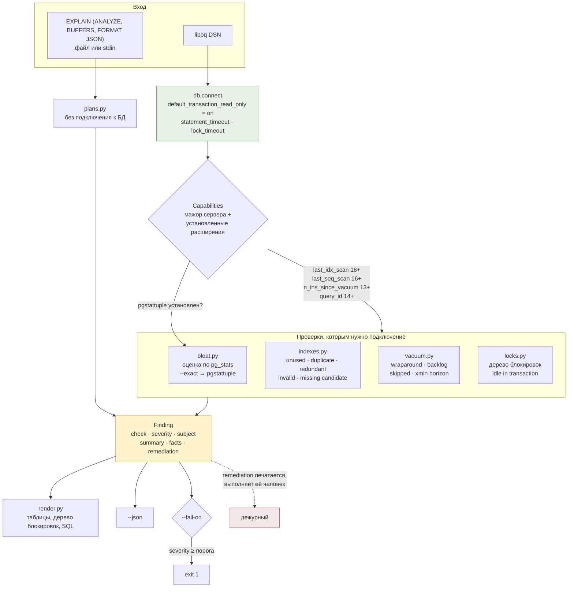

# postgres-toolkit

Диагностика PostgreSQL для дежурного инженера — раздутие, гигиена индексов, разбор
планов, вакуум и блокировки — работающая только на чтение и печатающая SQL вместо
того, чтобы его выполнять.

---

## Задача

Набор для разбора инцидента с базой обычно выглядит как папка с `.sql`-файлами,
собранными из блогов за несколько лет. В три часа ночи у неё три проблемы, и все три
дорогие.

**Она не говорит, чему верить.** Запрос оценки раздутия печатает `73%`. Это оценка,
построенная из `pg_stats`, и она может ошибаться в обе стороны, но в выводе она
выглядит как факт. Решение «переписать таблицу на 400 ГБ» принимается по числу, у
которого нет ни погрешности, ни способа её узнать.

**Она не говорит, на какой версии работает.** `pg_stat_all_indexes.last_idx_scan`
появился в 16, `n_ins_since_vacuum` — в 13, счётчики контрольных точек уехали из
`pg_stat_bgwriter` в `pg_stat_checkpointer` в 17. Запрос, скопированный с чужого
кластера, либо падает с `UndefinedColumn`, либо — хуже — молча перестаёт что-то
проверять.

**Она отвечает не на тот вопрос.** `pg_blocking_pids()` показывает, кто кого ждёт,
попарно. Вопрос дежурного — не «ждёт ли pid 4711», а «какую одну сессию убить, чтобы
разошлись остальные сорок», и эта сессия обычно не видна в списке ожидающих, потому
что сама ничего не ждёт.

Плюс отдельная категория: процедура резервного копирования, из которой никто ни разу
не восстанавливался. Такая процедура — не бэкап, а слух. Поэтому
[`backup/pitr.sh`](backup/pitr.sh) не описывает восстановление на момент времени, а
выполняет его целиком и проверяет границу по строкам.

---

## Архитектура



Две детали диаграммы несут смысл.

Первая — **ромб `Capabilities`**. Ни одна проверка не сравнивает версии в своём коде:
она спрашивает `caps.has("pg_stat_all_indexes.last_idx_scan")`, а весь список
version-gated колонок лежит одним словарём в `db.py`. Опечатка в имени колонки — это
`KeyError`, а не молча выключенная проверка.

Вторая — **пунктирная стрелка**. `remediation` — это текст. У процесса нет способа
его выполнить: соединение открыто с `default_transaction_read_only = on`.

---

## Что находит

| проверка | что именно | подробность в выводе |
|---|---|---|
| `bloat.table` · `bloat.index` | раздутие кучи и btree | метод (`estimate` / `pgstattuple` / `pgstatindex`), доля, байты |
| `index.unused` | ни одного сканирования | размер, `stats_reset`, `last_idx_scan` (16+) |
| `index.duplicate` | тот же путь доступа под другим именем | какой экземпляр оставить и почему |
| `index.redundant` | ключ — префикс другого индекса | какой индекс перекрывает |
| `index.invalid` | `indisvalid = false` | уникальный он или нет |
| `index.missing_candidate` | много последовательных сканирований большой таблицы | строк на сканирование, число индексных сканирований |
| `vacuum.wraparound` | `age(relfrozenxid)` в долях `autovacuum_freeze_max_age` | включая каталог и TOAST |
| `vacuum.multixact_wraparound` | `mxid_age(relminmxid)` | |
| `vacuum.backlog` · `vacuum.skipped` | мёртвые кортежи выше порога autovacuum | порог считается с учётом reloptions таблицы |
| `vacuum.xmin_horizon` | кто держит горизонт: сессия, prepared xact, слот репликации | возраст в транзакциях |
| `locks.blocking_root` | корень цепочки блокировок | сколько сессий держит, глубина цепочки |
| `locks.idle_in_transaction` | простой внутри транзакции | сколько простаивает, последний запрос |
| `locks.long_wait` · `locks.connection_pressure` | ожидание на блокировке, заполнение `max_connections` | |
| `plan.misestimate` | оценка строк против фактической | во сколько раз и в какую сторону |
| `plan.nested_loop` | внутренняя сторона выполнена много раз | ошибка оценки внешней стороны |
| `plan.external_sort` · `plan.hash_spill` | сортировка на диск, хеш в несколько батчей | сколько записано, сколько батчей |
| `plan.heap_fetches` | index-only scan, ходящий в кучу | доля строк |
| `plan.filter_discard` | прочитано много, возвращено мало | текст фильтра |

---

## Решения и компромиссы

### Оценка против `pgstattuple`

Два способа узнать, сколько места в таблице занято ничем, и они отвечают на разные
вопросы за разную цену.

Оценка восстанавливает размер, который таблица **должна** иметь: из
`pg_stats.avg_width` и `null_frac` собирается ширина среднего кортежа, из неё —
сколько их помещается на страницу с учётом fillfactor, из `reltuples` — сколько
страниц нужно. Разница с `relpages` и есть ответ. Это один запрос к каталогу; страниц
данных он не касается вообще.

`pgstattuple` читает каждую страницу отношения и возвращает точные `dead_tuple_len` и
`free_space`. На таблице в 400 ГБ это 400 ГБ чтения, которое вы решили устроить
своему продовому кластеру.

Вывод `make bench` на посеянной демо-базе (`demo/bench.py`, медиана из семи прогонов):

```
PostgreSQL 17.11, 263 relations in the catalog
pgstattuple scanned 3 relations, 81.2 MB of pages, 7 repeats

method                   median ms   fastest ms
-----------------------------------------------
estimate (catalog)            18.6         17.3
pgstattuple (pages)           23.9         22.4

relation                            size  estimate %  measured %  delta pp  scan ms
-----------------------------------------------------------------------------------
public.invoices                  32.6 MB        70.0        65.7      +4.3     14.3
public.shipments                 29.3 MB        70.4        69.2      +1.2      8.9
public.invoices_number_idx       19.4 MB        70.2        72.6      -2.4      7.4
```

**Числа по времени здесь почти ничего не доказывают, и это надо сказать прямо.**
81 МБ целиком лежали в кеше, отношений всего три, разница 18.6 против 23.9 мс — шум,
и колонка `scan ms` гуляет между прогонами на несколько миллисекунд.
Значение имеет структура затрат, а не эти миллисекунды: колонка `estimate` — это
**один** запрос, покрывающий все 263 отношения каталога, и её стоимость не зависит от
их размера; колонка `scan ms` существует **для каждого отношения отдельно** и растёт
вместе с ним. На кластере, где рабочий набор не помещается в память, вторая колонка
превращается в время чтения с диска, а первая не меняется.

Что действительно измерено — расхождение: **от −2.4 до +4.3 процентных пункта** на
трёх отношениях. Направление ошибки непредсказуемо, и это важнее её величины.
`public.invoices` был провакуумирован, поэтому мёртвых кортежей в нём нет, а свободное
место есть; модель ширины кортежа об оставшихся указателях на строки ничего не знает и
завышает. `public.invoices_number_idx` — наоборот, занижает: оценка плотности листа
btree грубее, чем `avg_leaf_density` из `pgstatindex`. Четыре пункта на числе 70 —
мелочь, те же четыре пункта на числе 15 — треть ответа.

Где оценка ломается сильнее и где инструмент говорит об этом вслух:

- **колонки без статистики.** Если по колонке не было `ANALYZE`, её вклад в ширину
  кортежа равен нулю, и таблица выглядит раздутой сильнее, чем есть. Такие отношения
  помечаются `stats_unusable`, серьёзность принудительно понижается до `notice`, а в
  строке вывода написано «statistics incomplete, treat as a hint»;
- **тип `name`.** Фиксированные 64 байта, которые модель средней ширины считает иначе;
  проверяется явно;
- **TOAST.** Учитывается грубо — `ceil(toasttuples / 4)`. Для таблицы, где основной
  объём вынесен в TOAST, оценке верить нельзя;
- **устаревший `reltuples`.** Оценка живёт на статистике; между двумя `ANALYZE` она
  отвечает про прошлое состояние таблицы.

Поэтому **оценка — умолчание, а `--exact` включается руками**. Инструмент не имеет
права сам решить прочитать терабайт: он умеет посчитать бесплатно и умеет посчитать
точно, а выбор между этими двумя вещами — не его.

### Почему совет «удалите неиспользуемый индекс» опасен

`idx_scan = 0` в `pg_stat_all_indexes` — это не «индекс не нужен». Это «счётчик равен
нулю», и между этими утверждениями лежат три вещи.

**Окно наблюдения.** Счётчик считает не с начала времён, а с последнего сброса
статистики. Ровно это проверяет
`test_resetting_statistics_makes_a_used_index_look_unused`: в изолированной базе
создаётся индекс, по нему выполняются 50 сканирований, проверка молчит; затем
вызывается `pg_stat_reset()` — и тот же самый индекс, который только что использовали,
попадает в отчёт как неиспользуемый. Это не гипотеза из документации, это тест,
падающий, если поведение изменится.

Отсюда — `pg_stat_database.stats_reset` в `facts` каждой находки и серьёзность,
зависящая от него: `warning`, если момент сброса известен, и всего лишь `notice`, если
он `NULL`. `NULL` — самый частый случай на кластере, который никто не сбрасывал, и он
означает не «статистика с самого начала», а «начало окна неизвестно»: после аварийной
остановки статистика теряется без всякой отметки. В выводе демо это видно — все находки
`index.unused` имеют серьёзность `notice` и приписку
`statistics have no recorded reset point`.

**Реплики.** `pg_stat_all_indexes` — счётчик узла. Индекс, не тронутый на первичном
сервере, может быть единственным, что держит аналитические запросы на реплике. Поэтому
`remediation` начинается не с `DROP`, а со строки
`-- confirm on every replica first: pg_stat_all_indexes.idx_scan there is counted separately`.

**Редкие запросы.** Индекс под квартальный отчёт по определению не используется 89 дней
из 90. Инструмент не может это различить; он может сообщить дату последнего
использования — `last_idx_scan`, начиная с PostgreSQL 16, — и не сообщать её на
серверах старше, вместо того чтобы подставлять `NULL` и делать вид, что данные есть
(`test_the_pre_16_fallback_drops_the_column_from_the_findings_rather_than_lying`).

Отдельно: индексы, которые что-то **обеспечивают** — уникальные, первичные ключи,
подпирающие ограничение, служащие replica identity, — не предлагаются к удалению
никогда, ни в одной из проверок. `test_primary_keys_are_never_reported_as_unused_however_idle_they_are`
проверяет это на реальном каталоге, где первичный ключ действительно не сканировался ни
разу.

И весь `DROP INDEX` печатается только в форме `CONCURRENTLY`
(`test_dropping_an_index_is_always_advised_concurrently`): обычный `DROP INDEX` берёт
`ACCESS EXCLUSIVE` на таблицу, и на нагруженном кластере это остановка.

### Только чтение — не осторожность, а конструкция

Инструмент физически не может писать: соединение открывается с
`default_transaction_read_only = on`, и попытка любого DDL заканчивается
`ReadOnlySqlTransaction` (`test_the_connection_the_tool_uses_cannot_write`). Ни одна
проверка не выполняет `VACUUM`, `REINDEX` или `DROP` — они попадают в вывод как текст.

Аргументы против кнопки «починить», в порядке убывания веса:

1. **Разница между `VACUUM` и `VACUUM FULL` — это разница между «ничего не заметили» и
   «сайт лежал сорок минут».** Инструмент, который может действовать, — это инструмент,
   который может подействовать не туда, и произойдёт это ровно в тот момент, когда
   человек за клавиатурой устал. Печатаемый SQL называет замок прямо в тексте:
   `VACUUM FULL public.shipments;  -- ACCESS EXCLUSIVE for the whole rewrite`.
2. **Правильные операции длятся дольше, чем живёт процесс.** `REINDEX CONCURRENTLY` и
   `pg_repack` на большой таблице — это часы. Запускать их из процесса, у которого
   выставлен `statement_timeout`, некуда: прерванный `REINDEX CONCURRENTLY` оставляет
   после себя невалидный индекс — ровно ту находку, которую этот же инструмент
   репортит как `index.invalid`.
3. **Решение зависит от того, чего в базе не видно.** Есть ли место под вторую копию
   индекса, есть ли окно, стоит ли за этим кластером реплика, ждёт ли этого индекса
   отчёт в следующий понедельник. Каталог не знает ничего из этого.

Цена решения — лишний шаг копирования. Она принята сознательно: `--json` даёт
машинам структуру, `--fail-on` даёт планировщику код возврата, а выполнение остаётся
человеку.

Тот же принцип в проверке кандидатов на индекс: `index.missing_candidate` сообщает, что
таблицу читают целиком по шестьдесят раз, и **не предлагает колонку**. Каталог знает,
что сканирование было, но не знает, каким был предикат; вместо выдумки в
`remediation` стоит запрос к `pg_stat_statements`, который это выясняет
(`test_the_candidate_advice_sends_the_reader_to_the_queries_not_to_a_guessed_column`).

### Чего анализатор планов не видит

`pgtk plan` читает JSON и не подключается к базе — план из чата инцидента разбирается
без VPN к кластеру, о котором идёт речь. За это приходится платить, и границы стоит
назвать до того, как на выводе построят решение.

- **Один прогон, а не распределение.** `EXPLAIN ANALYZE` описывает то, что случилось
  один раз. Запрос, который тормозит в одном случае из ста, покажет остальные
  девяносто девять.
- **Значения параметров в плане отсутствуют.** Ошибка оценки, возникающая только для
  конкретного значения, невидима; разница между generic и custom планом
  подготовленного запроса — тоже.
- **`ANALYZE` действительно выполняет запрос.** Для `UPDATE` и `DELETE` это означает
  транзакцию, которую надо откатить, и это ответственность человека, а не инструмента.
- **Инструментирование искажает время.** Замер времени на каждом узле сам стоит
  времени; на машинах с медленным `clock_gettime` план под `ANALYZE` может идти
  заметно дольше, чем без него. Числа `Actual Total Time` — верхняя оценка.
- **`BUFFERS` запрашивается, но не анализируется.** Опция стоит в документации и в
  демо, потому что без неё план бесполезен для человека, но правил по счётчикам
  буферов в инструменте сейчас нет. Это не «поддерживается частично», это «не
  реализовано».
- **Параллельные планы считаются как есть.** `Actual Rows` — на один цикл одного
  воркера; проверка вложенных циклов берёт `Actual Loops` внутреннего узла и не
  раскладывает его по воркерам.
- **Ожидания на блокировках, время в сети и время планирования альтернатив в плане
  отсутствуют.** Запрос, простоявший тридцать секунд на блокировке, покажет в плане
  двадцать миллисекунд выполнения. Это соседняя команда — `pgtk locks`.

Пороги при этом настраиваются, и это не украшение. `plan.nested_loop` по умолчанию
срабатывает от 10 000 итераций внутренней стороны, потому что вложенный цикл сам по
себе не диагноз: он плох ровно тогда, когда внешняя сторона оказалась больше
запланированной. Поэтому в находке лежит не только число итераций, но и во сколько раз
ошиблась оценка внешней стороны, а в тексте написано «сначала почините оценку, а не
выключайте тип соединения».

### Швы версионной переносимости

Проверки читают четыре колонки, которых нет на всех поддерживаемых версиях. Все четыре
лежат одним словарём:

| колонка | появилась | кто читает |
|---|---|---|
| `pg_stat_all_tables.n_ins_since_vacuum` | 13 | `vacuum` |
| `pg_stat_activity.query_id` | 14 | `locks` |
| `pg_stat_all_indexes.last_idx_scan` | 16 | `indexes` |
| `pg_stat_all_tables.last_seq_scan` | 16 | `indexes` |

Проверяется это тремя разными способами, потому что ошибиться тут можно тремя
способами.

**Утверждение против живого каталога.** `test_capability_claims_match_the_live_catalog`
берёт каждую колонку из словаря, ищет её в `pg_attribute` подключённого сервера и
сравнивает результат с тем, что говорит `Capabilities.has`. Тест параметризован по
колонкам и выполняется на каждом образе, поэтому запись «появилась в 16» — не
комментарий, а проверяемое утверждение.

**Ветка для старых серверов выполняется всегда.** Проблема запасного пути в том, что
его никто не запускает. `test_the_pre_16_index_query_still_runs_and_reports_no_last_scan_time`
подменяет `Capabilities` на версию 15 при подключении к 16 или 17, гоняет запрос без
`last_idx_scan` и сравнивает вывод с полным: множество индексов совпадает,
`last_idx_scan` везде `None`, а вердикт «не используется» не меняется — от колонки
зависит доказательство, а не вывод. То же самое для 12 и `n_ins_since_vacuum`.

**Шов, который инструмент не переходит, зафиксирован тестом.** Счётчики контрольных
точек уехали из `pg_stat_bgwriter` в `pg_stat_checkpointer` в PostgreSQL 17. Здесь их
никто не читает, но
`test_pg_stat_bgwriter_lost_its_checkpoint_columns_in_17` утверждает, что
`checkpoints_timed` есть на 16 и нет на 17 — чтобы фраза из этого README проверялась, а
не помнилась.

Нижняя граница — PostgreSQL 13; на более старом сервере `Database` поднимает
`UnsupportedServerError` с внятным текстом вместо `UndefinedColumn` из середины
портянки SQL.

**Реально прогоняется на 16 и 17.** Версии 13, 14 и 15 закрыты гейтами и покрыты
принудительным выполнением запасной ветки, но контейнеров с ними в тестах нет —
образы стоят места на диске, а два мажора вокруг интересующего шва дают больше, чем
пять подряд. Это ограничение, а не покрытие.

### Почему анализ перекрытия индексов написан на Python, а не на SQL

Решение «индекс A перекрыт индексом B» — это сравнение двух упорядоченных векторов
ключей плюс четыре побочных условия. На SQL это самосоединение `pg_index` со срезами
массивов `indkey`, `indclass` и `indoption`, которое невозможно прочитать глазами и
тем более отревьюить.

В `indexes.py` это функция `covers()` на двадцать строк, и рядом с ней таблица
случаев, где она обязана **промолчать**: суффикс — не префикс; ведущая колонка
`DESC` — другой путь доступа, потому что merge join потребует `ASC`; частичный индекс
не перекрывает безусловный; gin не перекрывает btree; потеря `INCLUDE`-колонки
превращает index-only scan в обращение к куче. Каждый из этих случаев — отдельный тест
(`tests/test_index_rules.py`), и это единственное место в репозитории, где вообще
предлагается что-то удалить.

### Почему фикстура — настоящий PostgreSQL, а не моки

Каждая проверка здесь — утверждение о том, что конкретная версия PostgreSQL кладёт в
`pg_stat_all_indexes` или `pg_class`. Мок проверил бы, что фикстура согласована с
запросом, то есть единственное, что не может сломаться.

Поэтому `tests/conftest.py` поднимает контейнер сам — тридцать строк вокруг
`docker run`, без зависимости от testcontainers, — и сеет базу, сломанную восемью
названными способами: 70 % удалённых строк без переписывания; провакуумленный btree,
сохранивший страницы; пара одинаковых индексов; индекс-префикс; неиспользуемый индекс
рядом с используемым; невалидный индекс, оставшийся от **настоящего** упавшего
`CREATE UNIQUE INDEX CONCURRENTLY` по неуникальным данным; две коррелированные
колонки, на которых планировщик ошибается; таблица с выключенным autovacuum и
мёртвыми кортежами выше порога. Блокировки строятся тремя реальными сессиями,
дерущимися за одну строку.

Сидинг занимает **около 6 секунд** и создаёт около 1.7 млн строк; на посеянном
кластере `docker compose` держит `fsync=off`, потому что долговечность у базы, которую
выбросят через минуту, ничего не защищает.

### Почему цепочка блокировок, а не список

`pg_blocking_pids()` возвращает рёбра. Полезный артефакт — дерево, и дерево строится
с двумя оговорками, каждая из которых стоила отдельного теста.

Первая: **цикл**. Детектор дедлоков ещё не сработал или снимок поймал два ребра из
разных мгновений — и обход по наивной рекурсии не заканчивается. Обход несёт множество
посещённых.

Вторая: **сессия, заблокированная сразу двумя**. Она висит под обоими блокирующими, и
подсчёт узлов дерева насчитал бы больше сессий, чем существует. `size()` считает
различные pid'ы, а не узлы
(`test_a_session_blocked_by_two_others_is_counted_once`).

Так выглядит вывод на посеянной цепочке из трёх сессий:

```
holds pid 121 pgtk@nightly-batch state=idle in transaction
      UPDATE orders SET status = 'held' WHERE id = 1
`-- waits pid 122 pgtk@checkout-api state=active ShareLock on transactionid
          UPDATE orders SET status = $1 WHERE id = 1
    `-- waits pid 123 pgtk@reporting state=active ExclusiveLock on orders
              UPDATE orders SET status = $1 WHERE id = 1
```

Корень — `idle in transaction`: сессия, которая ничего не выполняет и которую поэтому
не видно ни в одном списке «долгих запросов». `remediation` для неё говорит и это:
`pg_cancel_backend` отменять нечего, транзакцию завершает только
`pg_terminate_backend`.

### Почему порог autovacuum пересчитывается, а не аппроксимируется

`vacuum.backlog` сравнивает `n_dead_tup` не с константой, а с той же формулой, которой
пользуется сам autovacuum:
`autovacuum_vacuum_threshold + autovacuum_vacuum_scale_factor × reltuples`, где обе
величины берутся из `reloptions` таблицы, если они там заданы, и из настроек кластера
иначе.

Аппроксимация по глобальным настройкам ошибается ровно в том случае, ради которого всё
это и пишется: на таблице, где кто-то осознанно покрутил ручку. Сообщать «autovacuum
должен был отработать» про таблицу, у которой `autovacuum_vacuum_scale_factor = 0.01`,
— это шум, а шум в диагностическом отчёте дороже отсутствующей проверки.

Отдельно стоит `vacuum.xmin_horizon`, и в реальных инцидентах он первый по важности,
хотя в файле последний. Открытая транзакция, забытый prepared xact или неактивный слот
репликации означают, что `VACUUM` отрабатывает, рапортует об успехе и не удаляет
ничего. Поэтому текст `vacuum.backlog` заканчивается строкой «если мёртвые кортежи
после этого не уменьшились — смотрите `vacuum.xmin_horizon`».

---

## Метрики

Всё ниже — вывод команд из этого репозитория на этой машине.

### Тесты

```
$ make test        # PGTK_TEST_IMAGES=postgres:17-alpine,postgres:16-alpine
218 passed in 353.54s (0:05:53)
```

Из них 63 не требуют контейнера (`make test-fast`): правила разбора планов,
перекрытие индексов, построение дерева блокировок, пороги autovacuum, декодирование
`server_version_num`. Остальные выполняются дважды — против PostgreSQL 17.11 и 16.14,
каждый со своим контейнером и своим сидингом.

### Раздутие: оценка против измерения

Таблица `make bench` приведена выше в разделе «Решения и компромиссы».

### Восстановление на момент времени

`make pitr` — настоящий круг: базовый бэкап, архивация WAL, восстановление во второй
каталог данных на момент между двумя вставками, проверка по строкам. Полный вывод и
разбор — в [`backup/README.md`](backup/README.md). Итог прогона:

```
== what the recovery said
LOG:  starting point-in-time recovery to 2026-09-07 12:56:53.98745+00
LOG:  consistent recovery state reached at 0/3000120
LOG:  recovery stopping before commit of transaction 743, time 2026-09-07 12:56:56.533574+00
LOG:  last completed transaction was at log time 2026-09-07 12:56:51.410582+00

== verify
rows written before the target, in the restored cluster: 1 (want 1)
rows written after the target,  in the restored cluster: 0 (want 0)

PITR round trip verified
```

---

## Запуск одной командой

```bash
make demo
```

Поднимает PostgreSQL 17 в `docker compose`, сеет восемь патологий и прогоняет по ним
каждую команду — настоящим подпроцессом, а не импортом, чтобы на экране было ровно то,
что получит пользователь, включая коды возврата. Блокировки удерживаются живыми
сессиями на время выполнения `pgtk locks`.

```bash
make demo-down     # снести контейнер вместе с томом
```

### Фрагменты вывода демо

Числа настоящие, ширина таблиц урезана под страницу: вывод рассчитан на 120 колонок,
и часть столбцов здесь убрана. Полный вид даёт `make demo`.

```
$ pgtk bloat
pgtk_demo on PostgreSQL 17.11 — statistics-based estimate
                              bloat detail
| kind   | relation                               |    size |   bloat |  % | method      |
|--------+----------------------------------------+---------+---------+----+-------------|
| table  | public.invoices                        | 32.6 MB | 22.8 MB | 70 | estimate    |
| table  | public.shipments                       | 29.3 MB | 20.6 MB | 70 | estimate    |
| index  | public.invoices_number_idx  (invoices) | 19.4 MB | 13.6 MB | 70 | estimate    |
```

```
$ pgtk vacuum
autovacuum=on freeze_max_age=200,000,000 threshold=50 + 0.2 x reltuples
|sev       | check           | subject           | what                                            |
|----------+-----------------+-------------------+-------------------------------------------------|
|critical  | vacuum.skipped  | public.audit_log  | 100,000 dead tuples against a threshold of      |
|          |                 |                   | 30,050; autovacuum_enabled=false on this table  |
|warning   | vacuum.skipped  | public.shipments  | 84,000 dead tuples against a threshold of 7,250;|
|          |                 |                   | never vacuumed                                  |
|notice    | vacuum.backlog  | public.invoices   | 350,000 dead tuples against a threshold of      |
|          |                 |                   | 30,050; last vacuumed less than a minute ago    |
```

```
$ pgtk plan .demo-cache/correlated-columns.json
planning 2.1 ms, execution 34.6 ms, 7 nodes
|warning   | plan.misestimate | #0.0.0.0.0 Bitmap Heap Scan on events (e) | planner underestimated by 19x …
|warning   | plan.nested_loop | #0.0.0.0 Nested Loop                      | inner side executed 16,000 times …

+- plan.misestimate #0.0.0.0.0 Bitmap Heap Scan on events (e) --------------------------+
| ANALYZE events;                                                                       |
| -- a filter on several columns of one table underestimates when the columns correlate:|
| -- CREATE STATISTICS ... (dependencies, ndistinct) ON col_a, col_b FROM tbl;          |
+---------------------------------------------------------------------------------------+
```

```
$ pgtk --fail-on critical report
pgtk_demo on PostgreSQL 17.11, 12 finding(s)
...
exit code: 1  (--fail-on critical, and there are critical findings)
```

---

## Команды

```
pgtk [--dsn ...] [--json] [--fail-on never|notice|warning|critical] КОМАНДА
```

| команда | что делает |
|---|---|
| `bloat` | раздутие таблиц и btree; `--exact` подтверждает оценку через `pgstattuple` |
| `indexes` | неиспользуемые, дублирующие, избыточные, невалидные + кандидаты на индекс |
| `plan ФАЙЛ` | разбор `EXPLAIN (ANALYZE, BUFFERS, FORMAT JSON)`; `-` читает stdin, подключение не нужно |
| `vacuum` | wraparound, отставание autovacuum, удерживающие горизонт xmin |
| `locks` | дерево блокировок, простаивающие транзакции, распределение соединений |
| `report` | всё, чему нужно только подключение, одним проходом |

`--dsn` пустой означает стандартные переменные `PG*`. `--fail-on` даёт код возврата 1,
если хоть одна находка достигла указанной серьёзности — этого достаточно, чтобы
повесить `pgtk --fail-on critical report` в планировщик.

Прочитать вывод машиной:

```bash
pgtk --json indexes | jq '.findings[] | select(.check == "index.invalid")'
```

---

## Установка

```bash
pip install -e ".[dev]"
```

Нужен Python 3.11+ и `psycopg` 3. Для `--exact` в целевой базе должно быть установлено
расширение `pgstattuple`; если его нет, команда говорит об этом и не пытается
обойтись оценкой молча.

---

## Что проверяет CI

`.github/workflows/ci.yml`:

- `ruff check .` и `mypy` (строгий режим, `pgtk`, `tests`, `demo`);
- `shellcheck backup/pitr.sh`;
- `pytest` матрицей по `postgres:17-alpine` и `postgres:16-alpine`;
- `backup/pitr.sh` целиком — восстановление на момент времени выполняется на каждом
  прогоне, иначе через полгода выяснится, что оно больше не работает;
- `make demo` в отдельной job'е: сидинг и все команды до конца.

---

## Ограничения

- **Лестница серьёзности wraparound не проверена на настоящем старом кластере.**
  Чтобы `age(relfrozenxid)` дошёл до 180 миллионов, нужно зафиксировать 180 миллионов
  транзакций; измеренная на этой фикстуре скорость — около 1 700 транзакций в секунду,
  то есть около 29 часов. Поэтому запрос и построение находки проверяются на реальных
  значениях каталога с пониженным порогом отчёта, а сама лестница —
  юнит-тестом. Это компромисс, а не покрытие.
- **`BUFFERS` не анализируется.** См. раздел про планы.
- **Раздутие считается только для btree.** Для gin, gist, brin и hash оценки нет, и
  они не попадают в отчёт вовсе — молчание здесь честнее приблизительной цифры.
- **Индексы по выражениям выпадают из оценки раздутия.** Их колонки не находятся в
  `pg_stats` по имени, ширина берётся по умолчанию, и отношение помечается
  `stats_unusable`.
- **Секционированные таблицы видны по секциям.** `relkind = 'p'` не обрабатывается;
  каждая секция анализируется как отдельное отношение, свёртки по родителю нет.
- **Одна база за прогон.** Всё, кроме `age(datfrozenxid)`, ограничено базой из строки
  подключения: каталоги других баз кластера из соединения не видны.
- **Нет интеграции с `pg_stat_statements`.** Проверка кандидатов на индекс отправляет
  туда читателя, но сама расширение не опрашивает.
- **Тесты гоняются на 16 и 17.** Гейты для 13–15 выполняются принудительно, но
  контейнеров с этими версиями в наборе нет.

---

## Структура

```
pgtk/
  db.py         соединение только на чтение, ServerVersion, Capabilities
  findings.py   Finding: единая форма ответа всех проверок
  bloat.py      оценка по статистике + pgstattuple/pgstatindex
  indexes.py    инвентарь индексов, covers(), пять проверок
  plans.py      разбор EXPLAIN JSON, шесть правил
  vacuum.py     wraparound, отставание autovacuum, горизонт xmin
  locks.py      дерево блокировок, простой в транзакции, соединения
  render.py     таблицы rich, дерево, панели с SQL
  cli.py        click: шесть команд, --json, --fail-on

demo/
  pathology.py  восемь патологий; используется и демо, и тестами
  run.py        make demo: сидинг + прогон настоящего CLI
  bench.py      make bench: цена и расхождение двух методов

backup/
  pitr.sh       настоящий круг восстановления на момент времени
  README.md     разбор и вывод прогона

tests/
  conftest.py            контейнер на мажор, сидинг, соединения
  test_units.py          чистые функции
  test_plans.py          правила разбора планов на собранных вручную JSON
  test_index_rules.py    covers(), дубликаты, что удалять нельзя
  test_pg_*.py           против живого сервера, помечены `pg`
```

---

## Лицензия

MIT, см. [LICENSE](LICENSE).
